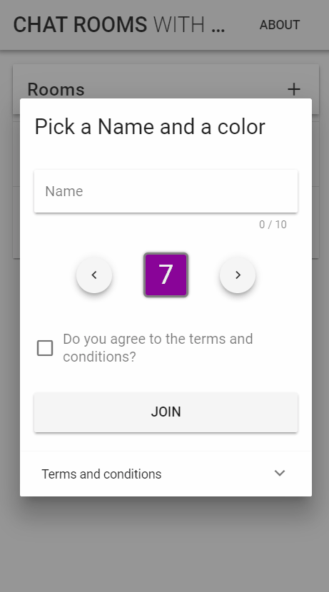

# socketio-vue-game-lobby

**This is work in progress and still has bugs, please come again later :)**

A bit more than basic chat room web app built with Express.js, Vue, Vuex, Vuetify and Socket.io + vue-socket.io. 
It is built to be pushed to Heroku, that's why /dist is not in .gitignore and npm run serve is not used atm.

# Features

* Join Modal with name and color picker (no check for duplicate names, but unique ids behind the scenes
* Room creation modal name and size. Full rooms will give a nice error on click
* Chat room. Always scrolls to bottom with <a href="https://github.com/theomessin/vue-chat-scroll">vue-chat-scroll</a>. Routed with room id




## Project setup
```
npm install
npm run build
npm run start
```

